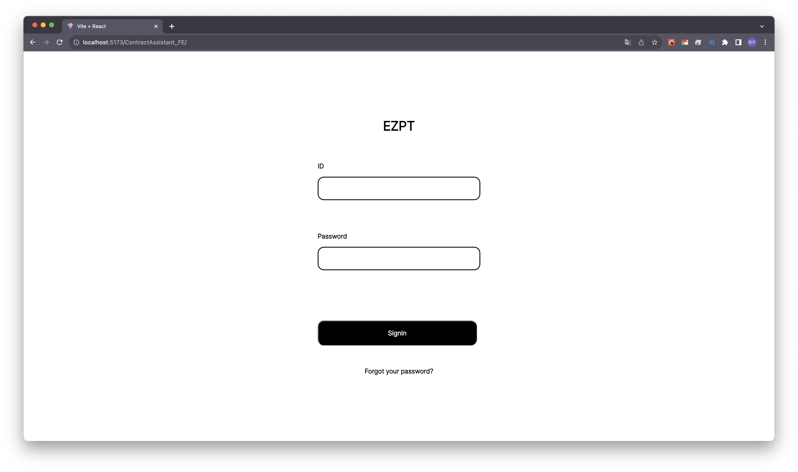
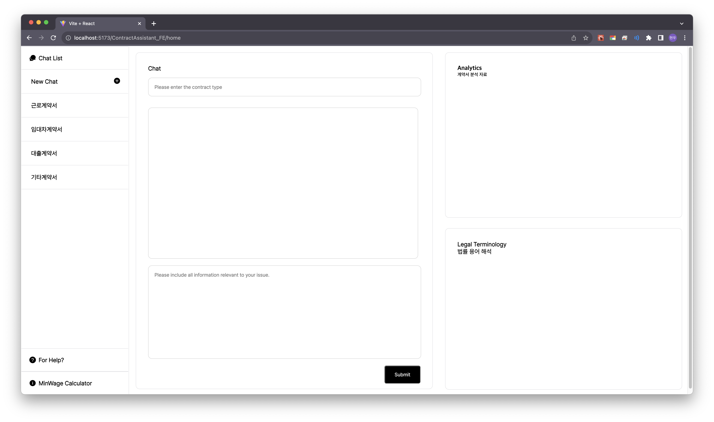
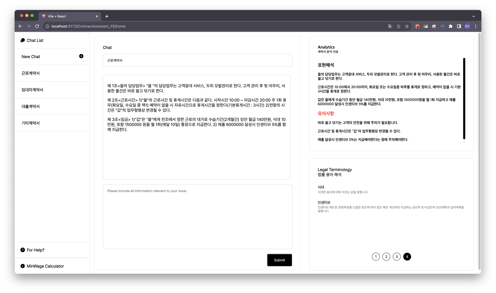
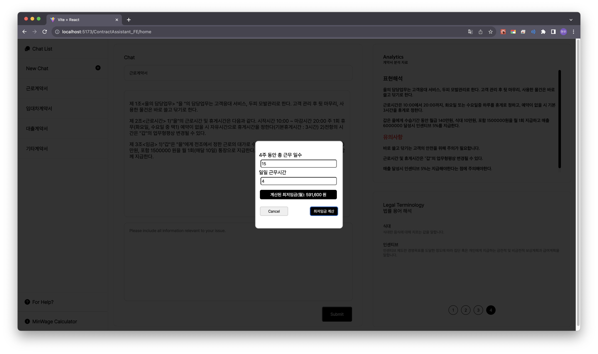

# 팀명

### EZPT(이지피티)

## 제출 타입 및 주제 : S타입 - 권리 보호를 위한 SW 개발

## 프로젝트 한 줄 설명

    사회 초년생의 계약서 작성을 돕는 생성형 AI 활용 서비스

## 프로젝트에 활용된 기술(3가지 이내)

### Frontend

- Yarn Package 매니저를 사용한 Vite 번들러를 이용한 React 라이브러리
- OpenAI API 사용

### Backend

- 공공데이터(법률용어)와 MySql을 활용한 SpringBoot 사용
https://www.data.go.kr/data/15069932/fileData.do

### 프로젝트 결과물

#### 로그인 화면

#### 초기화면

#### 구동했을 때

#### 최저임금 계산기

## 시연 영상

유튜브 링크 :
유튜브 영상 설명란에 다음과 같은 규칙을 사용하여 타임스탬프 작성할 것

1. 첫 타임스탬프가 00:00 으로 시작
